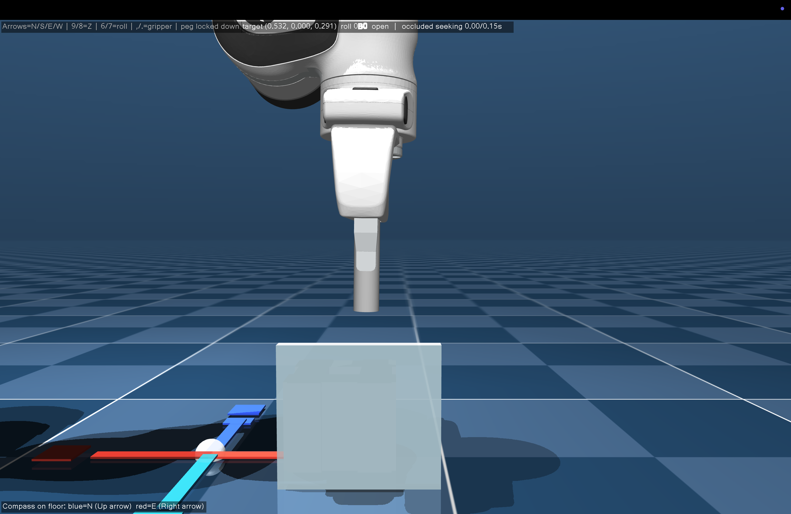

# Tester Guide

## What this project tests

You will control a simulated Franka robot arm holding a peg. Your goal is to
place the peg into a hole hidden behind a frosted wall. The hidden hole can move
between trials, so its location should not be assumed from an earlier trial.

### What to aim for

1. **Primary:** Keep contact forces low. If the peg does not line up with the
   hole, do not keep pushing into a jam against hard surfaces — back off, adjust,
   and try again gently.
2. **Secondary:** Complete the insertion as quickly as you can, without
   sacrificing gentle contact.

### What the view looks like



You see the robot gripper holding the peg, the frosted wall in front of the
socket, and (dimly) the hole area behind the wall. The live key guide is in the
**top-left** of the MuJoCo window; the floor compass legend is in the
**bottom-left**.

Keep this front-on camera view. Do not orbit, pan, or move behind the wall to
find the exact hole location — searching that way is outside the task.

The study compares four guidance modes:

| Mode | What you receive |
| --- | --- |
| No feedback | No visual or audio force guidance |
| Visual feedback | A force arrow and contact ring shown above the wall |
| Audio feedback | A contact click and Geiger-like ticks that change with lateral force |
| Visual + audio | Both forms of guidance |

The order of these modes is automatically counterbalanced. By default, the
session starts with one no-feedback familiarization trial, then runs three
measured trials for each of the four modes (13 trials total). Familiarization
data is saved separately from the main experiment summary. Each trial has a
2.5-minute (150 s) time limit; if the peg is not inserted in time, the window
closes and the study moves on.

## Before starting

- Complete the [setup guide](setup.md).
- Choose a tester ID in `firstname_lastname` format, such as `jane_doe`. Use
  lowercase letters, numbers, underscores, dots, or hyphens only — no spaces.
- Make sure the computer audio is on.
- Keep the terminal visible between trials so you can see the next prompt.
- Do not look inside result files for the randomized hole position during a
  session.
- Leave the MuJoCo camera at the default front-on angle. Do not move it behind
  the wall to peek at the hole.

## Start or resume the experiment

There is one experiment command:

```bash
python experiment.py --tester firstname_lastname
```

Replace `firstname_lastname` with your own ID (for example `jane_doe`). Reusing
the same ID and command resumes an interrupted session and skips completed
trials. This command is the same on macOS, Linux, and Windows; the runner
handles the macOS `mjpython` requirement automatically.

## Trial workflow

For every trial:

1. Read the next condition and trial type shown in the terminal.
2. Press Enter only when the tester is ready.
3. When the MuJoCo viewer opens, click inside it so it receives keyboard input.
   Keep the default camera angle; use the top-left key guide if you need a
   reminder of the controls.
4. Move the peg to search for the hidden hole and insert it. Prefer gentle
   contact over forcing a jam; speed matters, but low force comes first.
5. The trial ends when the peg maintains contact with the pad at the bottom of
   the hole, or when the 2.5-minute (150 s) time limit is reached. The MuJoCo
   window closes automatically in either case.
6. Return to the terminal and repeat when prompted for the next trial.

The first trial is a familiarization run with no force guidance, so you can
learn the controls before the measured conditions begin.

Move carefully near contact. The task records contact forces as well as
completion and timing information.

## Controls

For the study itself, you mainly need the arrow keys and `8` / `9`. Each press
moves the target by 5 mm. Hold-to-move is disabled in the standard experiment,
so repeated movement requires repeated key presses.

| Key | Action |
| --- | --- |
| Up arrow | Move north in +Y |
| Down arrow | Move south in -Y |
| Left arrow | Move west in -X |
| Right arrow | Move east in +X |
| `9` | Raise the peg in +Z |
| `8` | Lower the peg in -Z |

The peg starts locked pointing downward, which is the orientation needed for
insertion. You do not need to change orientation or the gripper for a normal
trial.

The keys below are optional and listed only for reference:

| Key | Action |
| --- | --- |
| Page Up / Page Down | Alternative raise / lower controls |
| `6` / `7` | Rotate the downward-facing peg left / right about the vertical axis |
| `,` / `.` | Open / close the gripper |

> [!IMPORTANT]
> Do not press `I`, `J`, `K`, or `U`. These are MuJoCo debug-view toggles, not
> robot controls.

## Understanding the feedback

- The green visual marker means the visual system is waiting for contact.
- The red/orange arrow indicates contact-force direction and magnitude.
- The red/orange ring marks the strongest contact surface.
- An audio click indicates contact above the configured threshold.
- Geiger-like ticks begin with sufficient lateral force and become faster as
  that force increases.

Visual feedback is projected above and in front of the wall. It indicates force,
not the hidden hole's exact position. Some trials intentionally provide only one
type of feedback or no feedback.

## Results

Study files are stored under `experiment_results/<tester_id>/`, where
`<tester_id>` matches the `--tester` value you used (for example
`experiment_results/jane_doe/`). They include the condition plan, trial
metadata, force telemetry, plots, and summary CSV files.

When the full session finishes, the runner creates a zip file next to that
folder and prints its path, for example:

```text
experiment_results/jane_doe.zip
```

That zip includes telemetry, plots, and each trial's `run_recording.mp4` (video
is recorded by default). Send the zip file back to the study organizer.

If a session is interrupted, rerun the same experiment command with the same
`--tester` ID. It resumes from the first incomplete trial.
