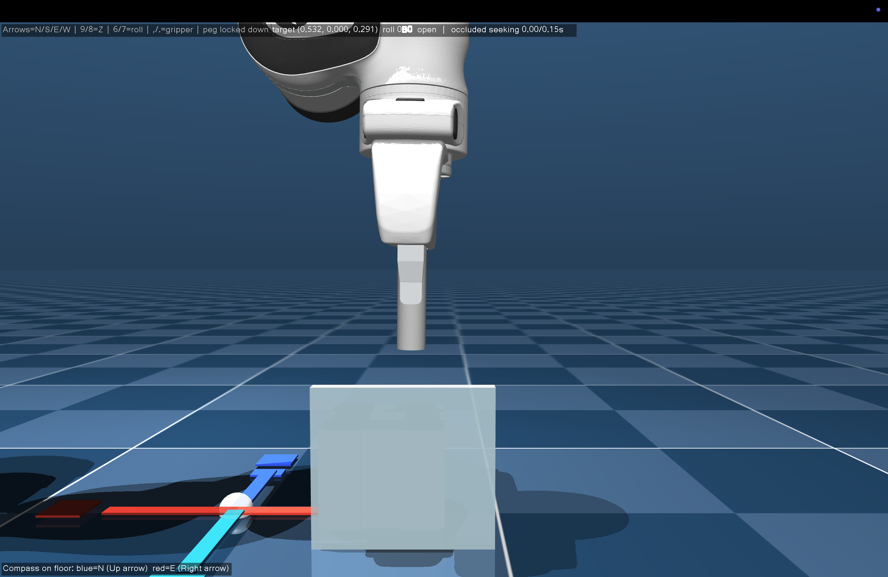

# 测试员指南

## 本项目测试什么

你将控制一台模拟的 Franka 机械臂，机械臂的末端夹持着一根插销。你的目标是将插销插入磨砂遮挡墙后面的孔中。隐藏孔的位置可能会在不同试验之间变化，因此不要根据之前的试验推测本次试验中的孔位。

## 摘要（TL;DR）

- **首要目标：尽量降低接触力。** 速度不如轻柔插入重要。
- 在 MuJoCo 窗口内单击一次，然后使用 `↑` 向前、`↓` 向后、`←` 向左、`→` 向右、`8` 向下、`9` 向上。
- 每次按键都只移动一个 5 毫米步长。短按和长按的效果相同；要移动多个步长，请持续重复按键。
- 搜索和插入时要轻柔；插销卡住时不要强行推动。
- 若要在 150 秒时限前完成，请向下降低插销，直到它接触并持续接触孔**底部**的检测垫。
- 请打开电脑音量或佩戴耳机，以便听到声音校准和声音反馈提示。

### 任务目标

1. **首要目标：** 保持接触力较低。即使插销看似已与孔对齐，若视觉或声音反馈显示接触力很大，也不要强行向下推进。应先退回、调整位置，再轻柔地重试。
2. **次要目标：** 在不牺牲轻柔接触的前提下，尽快完成插入。

### 画面说明



你将看到机械臂夹持着插销、位于插孔前方的磨砂遮挡墙，以及墙后隐约可见的孔位区域。MuJoCo 窗口左上角会显示实时按键提示，左下角会显示地面方向指示。

请保持默认的正面视角。不要旋转或平移相机，也不要将相机移动到遮挡墙后方查看孔的准确位置；这种搜索方式不属于本任务允许的操作。

本研究比较以下四种引导模式：

| 模式 | 你会获得的提示 |
| --- | --- |
| 无反馈 | 不提供视觉或声音力引导 |
| 视觉反馈 | 在遮挡墙上方显示力箭头和接触环 |
| 声音反馈 | 接触提示音，以及随横向力变化的盖革计数器式滴答声 |
| 视觉 + 声音反馈 | 同时提供上述两种引导 |

这些模式的顺序会自动进行平衡安排。默认情况下，测试首先进行 1 次无反馈的熟悉试验，然后在四种模式下各进行 3 次正式测量试验，共计 13 次试验。熟悉试验数据会单独保存，不会计入主要实验汇总。

每次试验的时间上限为 2.5 分钟（150 秒）。如果未能在规定时间内完成插入，窗口将自动关闭并进入下一次试验。

## 开始前

- 完成[环境设置指南](setup.md)中的步骤。
- 选择一个采用 `firstname_lastname` 格式的测试员 ID，例如 `jane_doe`。只能使用小写字母、数字、下划线、句点或连字符，不要使用空格。
- 确保电脑声音已开启。
- 在两次试验之间保持终端窗口可见，以便查看下一条提示。
- 测试期间不要查看结果文件来寻找随机生成的孔位。
- 保持 MuJoCo 的默认正面相机角度。不要把相机移动到遮挡墙后方偷看孔位。

## 开始或继续实验

实验只需使用以下一条命令：

```bash
python experiment.py --tester firstname_lastname
```

请将 `firstname_lastname` 替换为你自己的 ID，例如 `jane_doe`。使用相同的 ID 再次运行同一条命令时，程序会继续之前中断的测试，并跳过已经完成的试验。这条命令适用于 macOS、Linux 和 Windows；程序会自动处理 macOS 对 `mjpython` 的要求。

程序启动时，终端会显示一份简短说明，其中包括任务目标、四种反馈模式和六个主要移动按键。如果有任何不清楚的地方，请先停止操作，阅读本指南或询问研究组织者。只有在理解说明后才能输入 `YES`。

输入 `YES` 后，系统会立即播放一段简短、不会被记录的声音校准：先播放一次接触提示音，再播放由慢到快的滴答声。滴答声越快表示横向力越大；声音变快时应退回并重新调整。每位测试员都会听到该预览，即使其第一个正式测量条件没有声音反馈。

## 试验流程

测试开始时：

1. 阅读终端中显示的任务摘要。
2. 如果不确定任务目标、反馈模式或操作按键，请阅读本指南并向研究组织者提问。
3. 输入 `YES`，确认你已经理解测试说明。
4. 聆听简短的声音校准：先是一次接触提示音，随后是由慢到快的滴答声。这是标准化预览，不会被记录为一次试验。

之后，每次试验按以下步骤进行：

1. 查看加粗显示的 **Next trial** 行，其中会说明下一次试验的反馈条件和试验类型。
2. 测试员准备好后再按 Enter 键。
3. MuJoCo 窗口打开后，在窗口内单击一次，使其能够接收键盘输入。保持默认相机角度；如需查看操作提示，可参考左上角的按键说明。
4. 移动插销，寻找隐藏孔并尝试插入。发生接触时应轻柔操作，不要强行顶住卡点。速度虽然重要，但低接触力是首要目标。
5. 当插销持续接触到孔底部的检测垫时，试验完成。如果达到 2.5 分钟（150 秒）的时间上限，试验也会结束。无论哪种情况，MuJoCo 窗口都会自动关闭。
6. 返回终端，并在看到下一次试验提示后重复上述步骤。

第一次试验是不提供力引导的熟悉试验，目的是让你在正式测量开始前熟悉操作方式。

接近接触面时请小心移动。系统会记录接触力、任务是否完成以及完成时间等信息。

## 操作按键

正式测试主要使用方向键以及 `8`、`9` 键。每按一次，目标位置移动 5 毫米；短按和长按的效果相同。标准实验已关闭“按住连续移动”功能，因此如需多次移动，请重复按键。

| 按键 | 操作 |
| --- | --- |
| 上方向键 | 向北移动，即 +Y 方向 |
| 下方向键 | 向南移动，即 -Y 方向 |
| 左方向键 | 向西移动，即 -X 方向 |
| 右方向键 | 向东移动，即 +X 方向 |
| `9` | 向上抬起插销，即 +Z 方向 |
| `8` | 向下降低插销，即 -Z 方向 |

插销开始时已锁定为朝下姿态，这正是插入任务所需的方向。正常试验中无需改变插销姿态或控制夹爪。

以下按键为可选操作，仅供参考：

| 按键 | 操作 |
| --- | --- |
| Page Up / Page Down | 另一组抬起／降低插销的按键 |
| `6` / `7` | 将朝下的插销绕垂直轴向左／向右旋转 |
| `,` / `.` | 打开／闭合夹爪 |

> [!IMPORTANT]
> 请勿按下 `I`、`J`、`K` 或 `U`。这些按键用于切换 MuJoCo 的调试视图，并不是机械臂控制键。

## 如何理解反馈

- 绿色视觉标记表示视觉系统正在等待接触发生。
- 红色／橙色箭头表示接触力的方向和大小。由于力很敏感，箭头方向可能具有误导性；请重点关注其大小：较大的箭头或接触环表示应退回并重新调整，以降低接触力。
- 红色／橙色接触环标记接触力最强的表面。
- 当接触力超过设定阈值时，会播放一次接触提示音。
- 当横向力达到一定程度时，会开始播放盖革计数器式滴答声；横向力越大，滴答声越快。

视觉反馈会显示在遮挡墙的前上方。它表示接触力，而不是隐藏孔的准确位置。某些试验会有意只提供一种反馈，或完全不提供反馈。

## 实验结果

实验文件会保存在 `experiment_results/<tester_id>/` 中，其中 `<tester_id>` 与运行命令时传给 `--tester` 的值相同，例如 `experiment_results/jane_doe/`。其中包括反馈条件计划、试验元数据、力遥测数据、图表以及汇总 CSV 文件。

完整测试结束后，程序会在该文件夹旁边创建一个 ZIP 压缩文件，并在终端中显示其路径，例如：

```text
experiment_results/jane_doe.zip
```

该 ZIP 文件包含遥测数据、图表以及每次试验的 `run_recording.mp4`（实验默认录制视频）。请将此 ZIP 文件发送给研究组织者。

如果测试中途被打断，请使用相同的 `--tester` ID 再次运行同一条实验命令。程序会从第一个尚未完成的试验继续。
